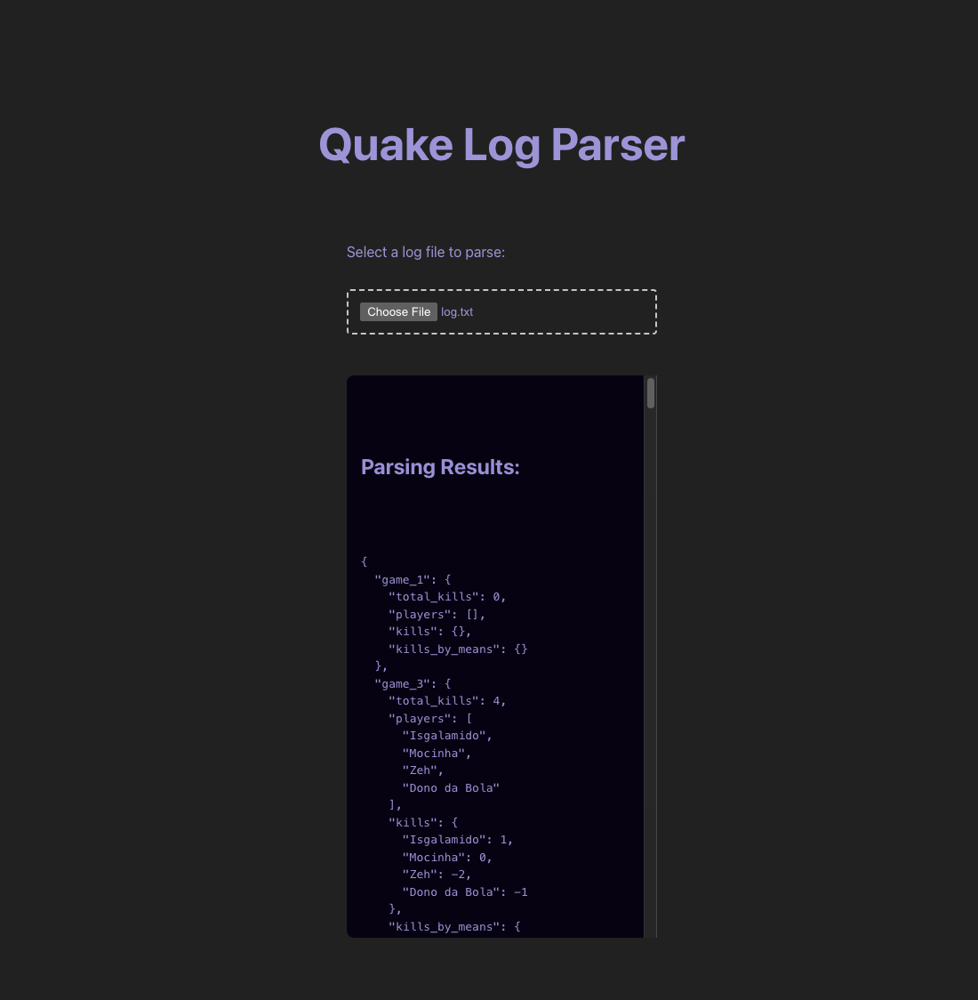

# Quake Log Parser

Quake Log Parser is a tool for processing Quake game log files and extracting detailed game statistics. It parses log events to calculate total kills, player performance (including kills and deaths), and generates player rankings.

The UI (in `main.ts`) allows the user to select a log file, parses its content line by line, and then displays the parsed game statistics and player rankings.

## Installation

1.  **Clone the Repository**

        `git clone <repository-url>

    cd quake-log-parser`

2.  **Install Dependencies**

    Install the runtime dependencies:

    `npm install`

    Install development dependencies (e.g., Vitest for unit testing):

    `npm install -D vitest`

## Usage

The application is designed to run in the browser. You can start the development server with:

`npm run dev`

This will launch the application. In the UI, you will see an option to select a log file (with `.txt` or `.log` extension). Once selected, the file is read and processed:

- Each line of the log is passed to the log parser.
- Game statistics are computed in real time.
- Results are displayed on the page, showing both detailed game statistics (in JSON format) and the overall player rankings.

### Example Output

After parsing a log file, the UI might display output similar to the following:

**Game Statistics:**

json

`{
  "game_1": {
    "total_kills": 4,
    "players": [
      "Isgalamido",
      "Mocinha",
      "Zeh",
      "Dono da Bola"
    ],
    "kills": {
      "Isgalamido": 1,
      "Mocinha": 0,
      "Zeh": -2,
      "Dono da Bola": -1
    },
    "kills_by_means": {
      "MOD_TRIGGER_HURT": 2,
      "MOD_RAILGUN": 2
    }
  }
}`

**Player Rankings:**

`1. Isgalamido - 1 kills
2. Mocinha - 0 kills
3. Dono da Bola - -1 kills
4. Zeh - -2 kills`

## Game Rules

- **World Kills:** When `<world>` kills a player, that player's kill count decreases by 1.
- **Player List:** `<world>` is not considered a player and is excluded from the list of players.
- **Ranking:** Player rankings are determined by their cumulative kill scores across all games.

## Running Tests

The project uses [Vitest](https://vitest.dev/) for unit testing. To run the test suite, execute:

`npm test`
